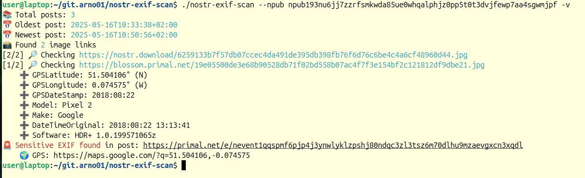
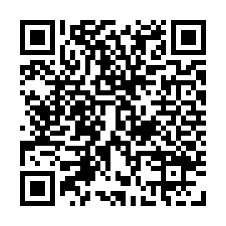

# nostr-exif-scan

> 🛡️ **Protect your privacy on Nostr**: Scan your image posts for leaked GPS, camera model, and other sensitive EXIF metadata — before someone else does.

📈 Scans 1,023 Nostr posts in just **7 seconds** — all in-memory with zero disk writes.

🚀 A fast Go-based CLI tool that pulls your events from public relays, detects embedded images, and scans them live for EXIF data like GPS coordinates, timestamps, and device identifiers.

---

## ✨ Features

- Pulls all your kind:1 events from public relays
- Detects and parses image links (`.jpg`, `.jpeg`, `.png`, `.gif`, `.webp`)
- Extracts EXIF metadata (GPS, device model, timestamp, etc.)
- Flags posts with sensitive EXIF data (e.g., GPS, camera model)
- Outputs direct links to Google Maps when coordinates are detected
- Fast parallel image scanning (configurable threads)

---

## 🔧 Build Instructions

Install Go if you haven't yet: https://go.dev/doc/install

If you have GNU Make installed:

```bash
make build
```

Or manually:

```bash
go mod init nostr-exif-scan
go mod tidy
go build -o nostr-exif-scan main.go
```

---

## 🚀 Usage

```bash
./nostr-exif-scan --npub npub1yourpublickeyhere
```

### Options

| Flag        | Description                                                   |
| ----------- | ------------------------------------------------------------- |
| `--npub`    | Your Nostr npub (required)                                    |
| `--threads` | Number of concurrent image scan workers (default: 8, max: 32) |
| `--limit`   | Max number of events to fetch (default: 10000)                |
| `--since`   | RFC3339 start date (e.g., `2023-01-01T00:00:00Z`)             |
| `--until`   | RFC3339 end date (e.g., `2024-01-01T00:00:00Z`)               |
| `-v`        | Verbose mode – print all EXIF fields                          |

### Example:

```bash
./nostr-exif-scan \
  --npub npub1... \
  --threads 8 \
  --limit 5000 \
  --since 2023-01-01T00:00:00Z \
  --until 2025-01-01T00:00:00Z \
  -v
```

---

## 🖼️ Example Run

Below is an example of nostr-exif-scan scanning posts and detecting GPS coordinates from image EXIF data:



---

## 🌐 Relays

By default, it uses:

* `wss://relay.nostr.band`
* `wss://nos.lol`
* `wss://relay.snort.social`

To override, create a `relays.txt` file in the working directory with one relay URL per line.

---

## 💡 Inspiration

This tool was inspired by the need to protect users from unintentionally leaking metadata when posting images to Nostr.

Stay safe out there! 🧭

---

## ⚡ Support the project with Bitcoin Lightning

You can scan this Lightning address QR code from your terminal or directly here on GitHub:

➡️  [lightning:andynostr@walletofsatoshi.com]


